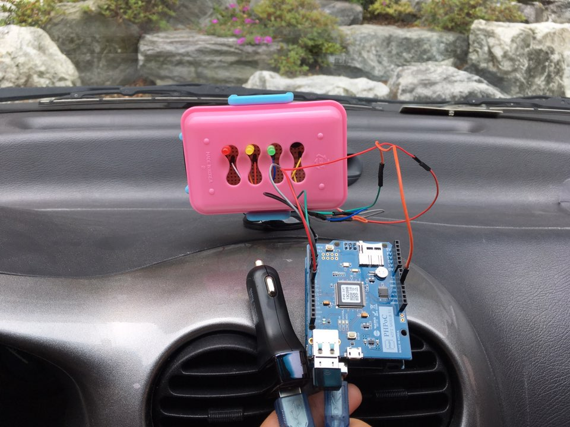
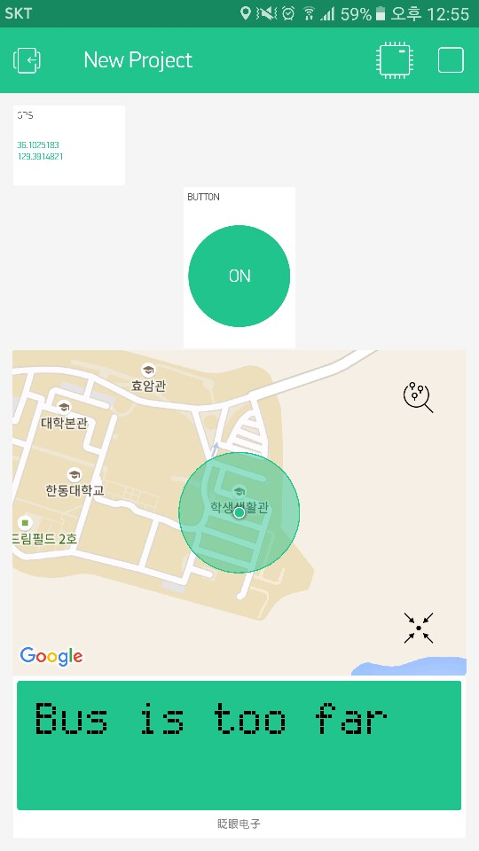
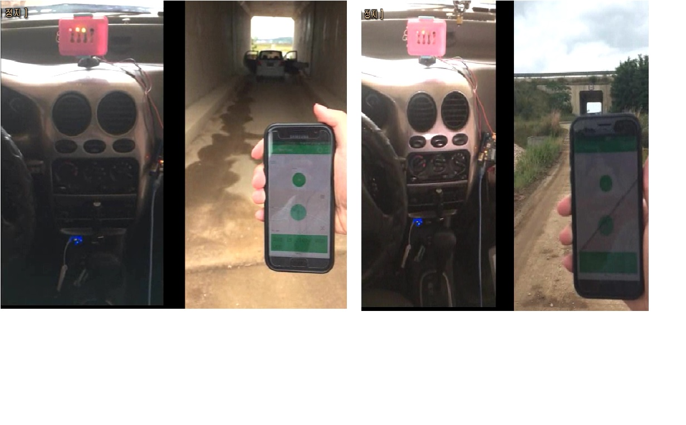

# BusStopper

This program is for stopping the near bus.  
Using Arduino with Blynk server.  
Main program is Busstopper.ino which used blynk.  
  
If user send signal using blynk application,  
the signal will be sent to bus driver which has arduino device,  
then bus driver will wait just few minutes, then user can take the bus.  
The signal is different by user's GPS location.  

  
This is the image of hardware, using LED x 3, Piezo buzzer
  
  
This is the image of software, using blynk server
  
  
This is the image of result, the alarm is different by user's GPS location.
